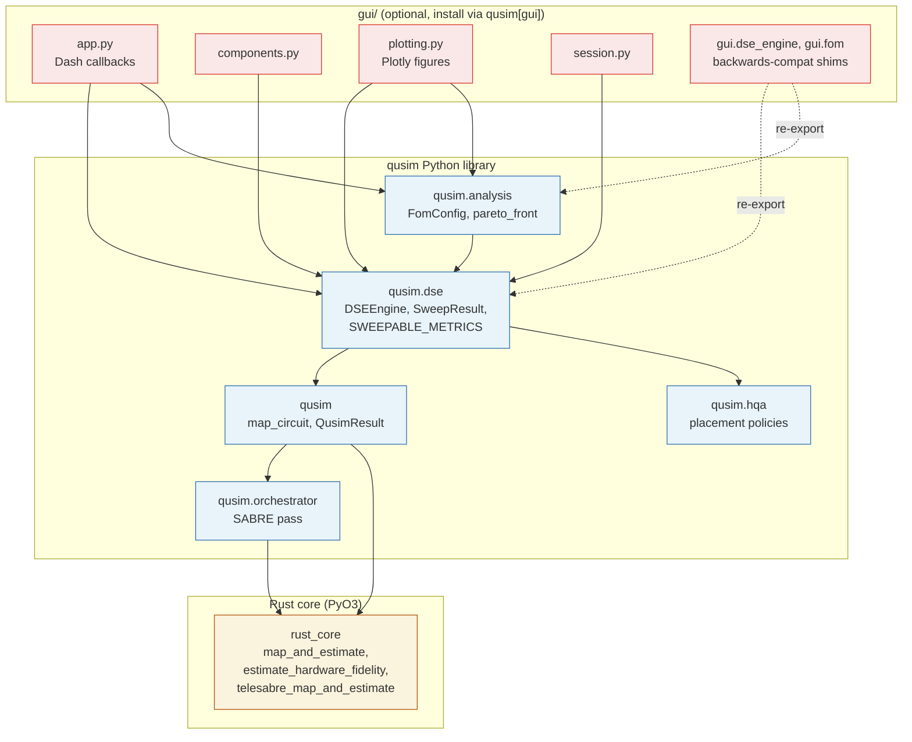

# qusim architecture

`qusim` is a multi-core quantum architecture simulator with a built-in
Design Space Exploration (DSE) toolkit. It splits cleanly into three
layers — a Rust core, a Python library, and an optional Dash GUI — so
the same machinery drives both interactive exploration and headless
scripts/notebooks.

## Layered view

```
┌────────────────────────────────────────────────────────────────────┐
│                            DASH  GUI  (optional)                   │
│                              gui/                                  │
│                                                                    │
│  app.py        — Dash app, callbacks, state stores                 │
│  components.py — sidebar / topbar / right-panel widgets            │
│  plotting.py   — Plotly figure builders (line / heatmap / 3D /     │
│                  parallel coords / Pareto / merit / topology)      │
│  session.py    — save / load full UI state                         │
│  examples.py   — canned DSE sessions (Examples dropdown)           │
│  constants.py  — VIEW_TABS, VIEW_MODES, dropdown styling           │
│  derivatives.py, interpolation.py — analysis-tab helpers           │
│                                                                    │
│  Backwards-compat shims:  gui/dse_engine.py, gui/fom.py            │
│                          (re-export from qusim.dse / qusim.analysis)│
└────────────────────────┬───────────────────────────────────────────┘
                         │  imports
                         ▼
┌────────────────────────────────────────────────────────────────────┐
│                        PYTHON  LIBRARY                             │
│                     python/qusim/                                  │
│                                                                    │
│  qusim/                                                            │
│  ├─ __init__.py         — map_circuit, telesabre_map_circuit,      │
│  │                        estimate_fidelity_from_cache[_batch],    │
│  │                        QusimResult                              │
│  ├─ orchestrator.py     — MultiCoreOrchestrator (SABRE pass)       │
│  ├─ hqa/                — HQA initial-placement policies           │
│  │  └─ placement.py     — InitialPlacement, PlacementConfig,       │
│  │                        generate_initial_placement               │
│  ├─ dse/                                                           │
│  │  ├─ __init__.py      — public API for DSE                       │
│  │  ├─ engine.py        — DSEEngine, sweep_1d/2d/3d/nd, run_cold,  │
│  │  │                     run_hot[_batch], parallel pool,          │
│  │  │                     CachedMapping, SweepResult,              │
│  │  │                     SweepProgress  (~2.4k lines, slated for  │
│  │  │                     internal split — see notes below)        │
│  │  ├─ axes.py          — MetricDef, SWEEPABLE_METRICS,            │
│  │  │                     CATEGORICAL_METRICS, NOISE_DEFAULTS,     │
│  │  │                     OUTPUT_METRICS, PARETO_METRIC_ORIENTATION│
│  │  └─ flatten.py       — flatten_sweep_to_table (sweep → table)   │
│  └─ analysis/                                                      │
│     ├─ __init__.py      — public API for analysis                  │
│     ├─ fom.py           — FomConfig, evaluate, compute_for_sweep,  │
│     │                     compute_breakdown, PRESETS               │
│     └─ pareto.py        — pareto_front, pareto_front_mask          │
│                                                                    │
│  rust_core (compiled .so)  — PyO3 bindings (see below)             │
└────────────────────────┬───────────────────────────────────────────┘
                         │  PyO3 / numpy zero-copy
                         ▼
┌────────────────────────────────────────────────────────────────────┐
│                          RUST  CORE                                │
│                            src/                                    │
│                                                                    │
│  python_api.rs   — PyO3 entry points:                              │
│                    • map_and_estimate                              │
│                    • estimate_hardware_fidelity[_batch]            │
│                    • telesabre_map_and_estimate                    │
│  hqa/            — hierarchical qubit assignment                   │
│  noise/          — depolarising / thermal-relaxation channels      │
│  routing/        — SABRE swap insertion                            │
│  telesabre/      — TeleSABRE FFI wrapper (csrc/ vendored)          │
│  circuit.rs, qubit.rs, lib.rs                                      │
└────────────────────────────────────────────────────────────────────┘
```

## Mermaid view (rendered on GitHub)



## Library entry points (what to import for what)

| Goal | Import |
|---|---|
| Map a single circuit | `from qusim import map_circuit, QusimResult` |
| Run a 1-D / N-D parameter sweep | `from qusim.dse import DSEEngine, NOISE_DEFAULTS` |
| Inspect the parameter registry | `from qusim.dse import SWEEPABLE_METRICS, METRIC_BY_KEY` |
| Re-evaluate cached fidelity | `from qusim import estimate_fidelity_from_cache_batch` |
| Define a custom Figure of Merit | `from qusim.analysis import FomConfig, compute_for_sweep` |
| Build a Pareto frontier | `from qusim.analysis import pareto_front, pareto_front_mask` |
| Drop a sweep into a flat table | `from qusim.dse import flatten_sweep_to_table` |
| Launch the Dash GUI | `qusim-dse` (installed by `pip install qusim[gui]`) |

## Cold-vs-hot path (DSE performance model)

```
                 ┌───────────────────────────┐
                 │   user calls run_cold(…)  │
                 └────────────┬──────────────┘
                              │  ~1–10 s
                              ▼
            ┌───────────────────────────────────┐
            │  Build qiskit circuit (qiskit)    │
            │  Build coupling map (topology.py) │
            │  Run HQA + SABRE  (orchestrator + │
            │     rust_core::map_and_estimate)  │
            │  Pack CachedMapping               │
            └────────────┬──────────────────────┘
                         │   reused for every hot eval
                         ▼
   ┌───────────────────────────────────────────────────┐
   │  run_hot(cached, noise) – ~0.1–1 ms per point     │
   │     rust_core::estimate_hardware_fidelity         │
   │  run_hot_batch(cached, [noise_1, …]) – batched    │
   │     rust_core::estimate_hardware_fidelity_batch   │
   └───────────────────────────────────────────────────┘
```

A sweep that touches only noise parameters runs the cold path **once** and
batches every point through the hot path. A sweep that varies
`num_qubits / num_cores / topology / placement / routing_algorithm` (the
*cold-path keys*) recompiles per cell — the engine schedules these in a
forkserver pool, capping concurrent workers by an empirical RAM model
(`_estimate_cold_mb`) so `MemAvailable` is never exceeded.

## Where to read further

- `docs/DSE_VIEWS.md` — every analysis tab in the GUI (parallel /
  importance / Pareto / elasticity / merit / correlation / topology).
- `docs/ROADMAP.md` — high-level milestones.
- `examples/dse_1d_noise_sweep.py` — minimal library-only DSE script.
- `examples/dse_2d_pareto.py` — architectural sweep + Pareto frontier.
- `examples/dse_fom_heatmap.py` — custom FoM evaluation.
- `python/qusim/dse/__init__.py` — public surface of the DSE package
  with a copy-pasteable usage sketch in the module docstring.

## `qusim/dse/` internal layout

The DSE package is split along its concern boundaries — every file
has one reason to change:

```
qusim/dse/
├── axes.py            # Parameter registry (MetricDef, SWEEPABLE_METRICS,
│                        NOISE_DEFAULTS, OUTPUT_METRICS, orientation)
├── memory.py          # /proc/meminfo helpers; thread-pool capping
├── circuits.py        # qft / ghz / random / qasm builders + transpile
├── topology.py        # inter/intra-core graph, slot layout, distance,
│                        K/B clamps for the user config
├── noise.py           # _merge_noise, _derived_tele_*, gate arrays
├── results.py         # CachedMapping, SweepResult, SweepProgress, RESULT_DTYPE
├── config.py          # alias expansion + _clamp_cfg + COLD_PATH_KEYS
├── flatten.py         # flatten_sweep_to_table (sweep result → table)
├── sweep.py           # _compile_one, _eval_cold_batch, parallel pool
├── engine.py          # DSEEngine façade — public run_cold/run_hot/sweep_*
└── backends/
    ├── base.py        # Backend protocol (compile -> CachedMapping)
    ├── hqa_sabre.py   # HQA + SABRE backend
    └── telesabre.py   # TeleSABRE C-library backend
```

Three duplications were collapsed during the split:

1. `run_cold` ↔ `_eval_cold_batch` share a `_compile_one(...)` helper
   in `sweep.py` so the foreground and worker cold paths can never
   drift.
2. HQA path ↔ TeleSABRE path are now `Backend` strategies; the
   shared cold-path skeleton lives in `_compile_one`. Adding a third
   routing algorithm is one new file plus an entry in
   `qusim/dse/backends/__init__.py:_BACKENDS`.
3. `sweep_1d` / `sweep_2d` / `sweep_3d` collapse to thin wrappers
   around `sweep_nd` that reshape the legacy
   `(xs[, ys[, zs]], grid)` tuple from a `SweepResult`.

Backwards compatibility is preserved via the `gui/dse_engine.py` and
`gui/fom.py` shims; the public `qusim.dse` / `qusim.analysis` API is
stable.
